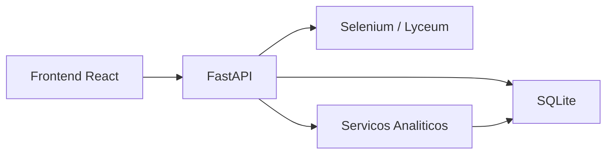

# DOCUMENTACAO TECNICA - NEXORA / SIMA

Documento consolidado para handoff tecnico a outra equipe de engenharia.
Baseado no estado atual do codigo em 21/05/2026.

## 1. Resumo executivo

A NEXORA e uma plataforma academica institucional com foco em:

- monitoramento de desempenho
- sincronizacao com portal academico
- leitura de risco
- analise historica por turmas e semestres
- exportacao e apoio a decisao

Arquitetura principal:

- backend em FastAPI
- frontend em React + Vite
- persistencia local em SQLite
- migracoes com Alembic

## 2. Perfis de acesso

- `student`
- `professor`
- `coordinator`
- `admin`
- `viewer`

No frontend, `admin` e apresentado como `proreitor`.

## 3. Estado atual de seguranca

Camadas ja aplicadas:

- `SECRET_KEY` e configuracoes sensiveis fora do codigo-fonte
- credenciais do Lyceum armazenadas criptografadas
- RBAC reforcado nas rotas mais sensiveis
- CORS por lista explicita
- cookies `HttpOnly` separados para acesso e refresh
- refresh token rotativo
- revogacao de sessao atual
- logout global
- revogacao de sessao por dispositivo
- limite de sessoes simultaneas por usuario
- upload historico com validacao de tipo, tamanho e volume
- Alembic como fluxo oficial de migracao

Gaps ainda abertos:

- rate limit por IP e por usuario
- lockout por tentativas repetidas de login
- cabecalhos HTTP de seguranca
- observabilidade de sessoes e alertas de reuse em producao

## 4. Estrutura do repositorio

```text
app/
  config.py
  database.py
  main.py
  models/
  routers/
  schemas/
  security/
  services/
  utils/
frontend/
  src/
seed/
tests/
alembic/
requirements.txt
alembic.ini
README.md
DOCUMENTACAO_TECNICA.md
```

## 5. Arquitetura de alto nivel



Camadas principais:

- `routers`: endpoints HTTP
- `services`: regras de negocio e integracoes
- `models`: ORM
- `schemas`: contratos de entrada e saida
- `security`: auth, sessao, RBAC, hashing e auditoria

## 6. Backend

### 6.1 Componentes centrais

- [app/main.py](./app/main.py)
- [app/config.py](./app/config.py)
- [app/database.py](./app/database.py)

Responsabilidades:

- subir a API
- registrar routers
- configurar CORS
- aplicar tarefas de bootstrap opcional
- executar reparos de dados legados

### 6.2 Startup

No `lifespan`:

- cria schema completo apenas se `AUTO_CREATE_SCHEMA=true`
- garante a tabela de `user_sessions` em desenvolvimento local
- semeia codigos institucionais
- cria admin default so se `CREATE_DEFAULT_ADMIN=true`
- roda seed de demo so se `SEED_EMPTY_DATABASE=true`
- sobe demo users so se `ENABLE_DEMO_BOOTSTRAP=true`
- migra credenciais legadas sensiveis
- roda reparo de frequencia legada se habilitado

## 7. Configuracao

Arquivo principal:

- [app/config.py](./app/config.py)

Configuracoes mais relevantes:

- `DATABASE_URL`
- `SECRET_KEY`
- `ACCESS_TOKEN_EXPIRE_MINUTES`
- `REFRESH_TOKEN_EXPIRE_DAYS`
- `ACCESS_COOKIE_NAME`
- `REFRESH_COOKIE_NAME`
- `SESSION_COOKIE_SECURE`
- `SESSION_COOKIE_SAMESITE`
- `MAX_ACTIVE_SESSIONS_PER_USER`
- `MAX_UPLOAD_BYTES`
- `MAX_HISTORICAL_RECORDS_PER_FILE`
- `CORS_ALLOWED_ORIGINS`
- `ENABLE_DEMO_BOOTSTRAP`
- `CREATE_DEFAULT_ADMIN`

## 8. Modelo de dados

### 8.1 Identidade e acesso

#### `User`

Arquivo:

- [app/models/user.py](./app/models/user.py)

Campos principais:

- `username`
- `full_name`
- `email`
- `hashed_password`
- `role`
- `is_active`
- `is_approved`

#### `UserSession`

Arquivo:

- [app/models/user_session.py](./app/models/user_session.py)

Campos principais:

- `user_id`
- `session_identifier`
- `refresh_token_hash`
- `previous_refresh_token_hash`
- `current_access_jti`
- `device_id`
- `device_label`
- `user_agent`
- `ip_address`
- `refresh_expires_at`
- `access_expires_at`
- `last_seen_at`
- `revoked_at`
- `revoked_reason`
- `is_current`

Objetivo:

- controle de sessao por dispositivo
- refresh rotativo
- deteccao de reuse do refresh token
- logout global e revogacao por sessao

### 8.2 Perfis

#### `Student`

- [app/models/student.py](./app/models/student.py)

#### `Professor`

- [app/models/professor.py](./app/models/professor.py)

#### `Coordinator`

- [app/models/coordinator.py](./app/models/coordinator.py)

#### `StaffRegistrationCode`

- [app/models/staff_code.py](./app/models/staff_code.py)

### 8.3 Dominio academico

#### `Course`

- [app/models/course.py](./app/models/course.py)

#### `Enrollment`

- [app/models/enrollment.py](./app/models/enrollment.py)

#### `Grade`

- [app/models/grade.py](./app/models/grade.py)

#### `Attendance`

- [app/models/attendance.py](./app/models/attendance.py)

### 8.4 Dados raspados

- [app/models/scraped_data.py](./app/models/scraped_data.py)

Entidades:

- `ScrapedGrade`
- `ScrapedAttendance`
- `ScrapedSubject`
- `ScrapedSchedule`

### 8.5 Dados historicos

- [app/models/historical_data.py](./app/models/historical_data.py)

Entidade:

- `HistoricalRecord`

## 9. Autenticacao, autorizacao e sessao

Arquivos:

- [app/security/auth.py](./app/security/auth.py)
- [app/security/session.py](./app/security/session.py)
- [app/security/rbac.py](./app/security/rbac.py)
- [app/security/access.py](./app/security/access.py)
- [app/security/hashing.py](./app/security/hashing.py)
- [app/security/secrets.py](./app/security/secrets.py)
- [app/security/audit.py](./app/security/audit.py)

### 9.1 Fluxo de login

1. cliente chama `POST /api/auth/login`
2. backend valida credenciais
3. backend cria uma `UserSession`
4. backend emite:
   - access token curto em cookie `HttpOnly`
   - refresh token rotativo em cookie `HttpOnly`
5. frontend chama `GET /api/auth/me`

### 9.2 Fluxo de refresh

1. frontend recebe `401`
2. tenta `POST /api/auth/refresh`
3. backend valida refresh atual
4. rotaciona refresh token
5. emite novo access cookie
6. frontend reexecuta a chamada original

### 9.3 Revogacao

Suportado hoje:

- logout da sessao atual
- logout global do usuario
- revogacao de sessao especifica por `session_identifier`

### 9.4 Controle por dispositivo

Cada sessao guarda:

- identificador da sessao
- identificador do dispositivo
- rotulo amigavel do dispositivo
- user agent
- IP
- ultimos tempos de uso

### 9.5 Limite de sessoes

Ao criar nova sessao, o backend aplica `MAX_ACTIVE_SESSIONS_PER_USER` e revoga sessoes mais antigas.

## 10. Endpoints principais

### 10.1 Autenticacao

- `POST /api/auth/register`
- `POST /api/auth/register/student`
- `POST /api/auth/register/professor`
- `POST /api/auth/register/coordinator`
- `POST /api/auth/login`
- `POST /api/auth/refresh`
- `POST /api/auth/logout`
- `POST /api/auth/logout-all`
- `GET /api/auth/sessions`
- `DELETE /api/auth/sessions/{session_identifier}`
- `GET /api/auth/me`
- `PATCH /api/auth/me`

### 10.2 Aluno

- `GET /api/students/me`
- `PATCH /api/students/me`
- `GET /api/students/me/grades`
- `GET /api/students/me/attendance`
- `GET /api/students/me/subjects`
- `GET /api/students/me/schedule`
- `POST /api/students/me/sync`
- `GET /api/students/me/sync-status`
- `POST /api/students/me/lyceum-credentials`

### 10.3 Professor

- `GET /api/professors/me`
- `PUT /api/professors/me/academic-courses`
- `PUT /api/professors/me/courses`
- `GET /api/professors/me/students`
- `GET /api/professors/me/overview`

### 10.4 Coordenador

- `GET /api/coordinators/me`
- `GET /api/coordinators/me/students`
- `GET /api/coordinators/me/subjects`
- `GET /api/coordinators/me/overview`

### 10.5 Historico e analise

- `POST /api/historical-data/upload`
- `GET /api/historical-data`
- `GET /api/historical-data/filters`
- `GET /api/historical-data/analysis-workspace`
- `GET /api/historical-data/analysis-workspace/at-risk-students`
- `GET /api/historical-data/analysis-workspace/export`

## 11. Servicos principais

### `scraper_service.py`

- login no Lyceum
- leitura de notas
- leitura de frequencia
- leitura de disciplinas
- leitura parcial de horarios

### `analytics_service.py`

- analytics do aluno
- metrics agregadas
- recomendações e visões consolidadas

### `historical_analysis_service.py`

- workspace analitico historico
- escopo por papel
- analise por turma
- analise entre turmas
- analise por semestre
- alunos em risco

### `statistical_risk_service.py`

- tratamento estatistico
- selecao de variaveis
- regressao logistica
- ensemble
- validacao cruzada

### `historical_export_service.py`

- exportacao em PDF, CSV, XLSX e JSON

### `gemini_service.py`

- parsing assistido por IA
- insights textuais

## 12. Frontend

Arquivos centrais:

- [frontend/src/App.jsx](./frontend/src/App.jsx)
- [frontend/src/contexts/AuthContext.jsx](./frontend/src/contexts/AuthContext.jsx)
- [frontend/src/services/api.js](./frontend/src/services/api.js)
- [frontend/src/lib/app-shell.js](./frontend/src/lib/app-shell.js)

### 12.1 Fluxo de sessao no frontend

- nao guarda access token em `localStorage`
- usa apenas:
  - cookie de acesso
  - cookie de refresh
- `AuthContext` reidrata sessao via `/auth/me`
- `api.js` tenta `/auth/refresh` automaticamente em `401`
- `localStorage` no frontend permanece apenas para caches nao sensiveis e `device_id`

### 12.2 Rotas publicas

- `/login`
- `/register`
- `/register/student`
- `/register/professor`
- `/register/coordinator`

### 12.3 Rotas protegidas

Aluno:

- `/student/dashboard`
- `/student/profile`

Professor:

- `/professor/dashboard`
- `/professor/courses`
- `/professor/profile`
- `/professor/historical-data`
- `/professor/analysis-center`

Coordenador:

- `/coordinator/dashboard`
- `/coordinator/analysis-center`

Pro-reitoria:

- `/proreitor/dashboard`
- `/proreitor/courses`
- `/proreitor/profile`
- `/proreitor/historical-data`
- `/proreitor/analysis-center`

## 13. Migrations

Arquivos:

- [alembic/env.py](./alembic/env.py)
- [alembic/versions/20260521_0001_baseline.py](./alembic/versions/20260521_0001_baseline.py)
- [alembic/versions/20260521_0002_user_sessions.py](./alembic/versions/20260521_0002_user_sessions.py)

Fluxo recomendado:

```powershell
.\.venv\Scripts\python.exe -m alembic upgrade head
```

Em desenvolvimento local, a tabela `user_sessions` tambem e garantida no startup para evitar quebra de ambiente antigo, mas o fluxo oficial continua sendo Alembic.

## 14. Como rodar manualmente

### Backend

```powershell
cd "C:\Users\guica\.gemini\antigravity\scratch\SIMA-mainn\SIMA-main"
.\.venv\Scripts\python.exe -m alembic upgrade head
.\.venv\Scripts\python.exe -m uvicorn app.main:app --reload
```

### Frontend

```powershell
cd "C:\Users\guica\.gemini\antigravity\scratch\SIMA-mainn\SIMA-main\frontend"
npm run dev
```

## 15. Testes

Arquivo principal atual:

- [tests/test_api.py](./tests/test_api.py)

Cobre:

- registro
- login
- refresh
- listagem de sessoes
- revogacao de sessao
- logout global
- CRUD basico de estudantes
- healthcheck

Comando:

```powershell
.\.venv\Scripts\python.exe -m pytest tests\test_api.py -q
```

## 16. Riscos e divida tecnica remanescente

### Seguranca

- falta rate limit
- falta lockout por tentativa
- faltam headers fortes de seguranca HTTP
- falta painel visual de sessoes no frontend

### Arquitetura

- ainda existem arquivos grandes demais
- parte da regra continua distribuida entre router e service
- bootstrap local ainda acumula responsabilidades demais

### Dados e scraping

- scraping depende de HTML externo
- frequencia e horarios ainda usam heuristicas em alguns cenarios

### Persistencia

- SQLite nao e o banco ideal para ambiente compartilhado real

## 17. Proximos passos recomendados

1. Migrar SQLite para PostgreSQL.
2. Adicionar rate limit e lockout no login.
3. Adicionar headers de seguranca HTTP.
4. Criar tela de gerenciamento de sessoes no frontend.
5. Fatiar servicos analiticos e paginas grandes.
6. Ampliar a suite de testes com banco isolado e testes E2E.
