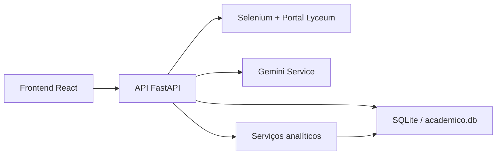

# DOCUMENTACAO TECNICA COMPLETA - NEXORA / SIMA

Documento consolidado a partir da leitura do código-fonte em 21/05/2026.
Objetivo: permitir que uma nova equipe de engenharia entenda o sistema, sua arquitetura, seus fluxos, seus riscos e os próximos passos recomendados sem depender de conhecimento tácito.

## Status de endurecimento aplicado em 21/05/2026

Nesta revisão, o projeto recebeu correções estruturais importantes:

- segredos deixaram de ficar hardcoded na configuração
- bootstrap demo e criação automática de admin ficaram desativados por padrão
- credenciais do Lyceum passaram a ser armazenadas criptografadas
- RBAC foi reforçado nas rotas críticas de alunos, cursos, notas e frequência
- CORS passou a ser configurável por origem explícita
- autenticacao do frontend foi migrada para cookies `HttpOnly` com refresh token rotativo
- upload histórico recebeu validação de extensão, tamanho e limite de registros
- fluxo oficial de migração com Alembic foi introduzido

Os riscos listados ao longo deste documento mostram a base original e também servem como backlog remanescente. Alguns deles já foram mitigados parcialmente nesta versão e outros ainda exigem evolução adicional, principalmente em testes, observabilidade e estratégia de autenticação do frontend.

## 1. Resumo executivo

O projeto implementa uma plataforma acadêmica institucional chamada NEXORA, derivada da base SIMA, com foco em:

- monitoramento do desempenho acadêmico
- leitura de risco por aluno, turma, disciplina e semestre
- sincronização de dados com o portal Lyceum
- análises históricas a partir de planilhas
- exportação de análises
- geração de insights com IA

O sistema é dividido em dois grandes blocos:

- backend FastAPI + SQLAlchemy + SQLite
- frontend React + Vite + Tailwind

Papéis de acesso existentes:

- `student`
- `professor`
- `coordinator`
- `admin`
- `viewer`

Na experiência do frontend, o papel `admin` é tratado como `proreitor`.

## 2. O que o produto faz hoje

### Aluno

- faz login com credenciais institucionais
- pode salvar credenciais do Lyceum
- sincroniza notas, frequência, disciplinas e parte dos dados acadêmicos do portal
- visualiza painel pessoal com média, frequência, risco e recomendações
- consulta perfil acadêmico, disciplinas e horários

### Professor

- faz cadastro com código institucional
- associa cursos acadêmicos ao perfil
- seleciona apenas as disciplinas do seu curso que realmente leciona
- vê dashboard docente, alunos vinculados, upload histórico e central analítica
- sobe planilhas para leitura e organização
- exporta análises
- abre o perfil detalhado do aluno em vários pontos da navegação

### Coordenador

- possui visão por curso
- acompanha estudantes, componentes e indicadores agregados
- usa central analítica com escopo mais amplo que o docente

### Pro-reitoria / Admin

- reutiliza boa parte das telas docentes
- tem escopo operacional ampliado

### Viewer

- usa um conjunto legado de dashboards institucionais gerais

## 3. Stack e dependências

### Backend

- `FastAPI`
- `SQLAlchemy 2.x`
- `SQLite`
- `Pydantic` / `pydantic-settings`
- `python-jose`
- `bcrypt`
- `python-multipart`
- `numpy`
- `scipy`
- `pandas`
- `openpyxl`
- `scikit-learn`
- `selenium`
- `reportlab`
- `google-generativeai`

Arquivo de referência:

- [requirements.txt](/C:/tmp/SIMA-main-fix/requirements.txt)

### Frontend

- `React 18`
- `React Router`
- `Axios`
- `Tailwind CSS`
- `Framer Motion`
- `Recharts`
- `lucide-react`
- `Vite`

Arquivo de referência:

- [frontend/package.json](/C:/tmp/SIMA-main-fix/frontend/package.json)

## 4. Estrutura do repositório

### Raiz

- `app/`: backend principal
- `frontend/`: SPA React
- `seed/`: massa de dados inicial
- `tests/`: testes automatizados
- `academico.db`: banco SQLite local
- `audit.log`: trilha de auditoria simples
- `run.bat`: inicialização no Windows

### Backend

- `app/main.py`: bootstrap da aplicação, routers, CORS, healthcheck, seeds e reparos
- `app/config.py`: configuração central
- `app/database.py`: engine, sessão e resolução de path do banco
- `app/models/`: entidades ORM
- `app/schemas/`: contratos de entrada e saída
- `app/routers/`: camada HTTP
- `app/security/`: JWT, hashing, auditoria e RBAC
- `app/services/`: scraping, analytics, IA, análise histórica e exportação
- `app/utils/`: normalização de disciplinas e frequência

### Frontend

- `frontend/src/App.jsx`: mapa das rotas
- `frontend/src/contexts/AuthContext.jsx`: sessão e login
- `frontend/src/services/api.js`: cliente Axios
- `frontend/src/components/`: layout, UI, modal de aluno, componentes de autenticação
- `frontend/src/pages/`: telas por papel e por funcionalidade
- `frontend/src/lib/app-shell.js`: navegação por papel

## 5. Arquitetura de alto nível

### Estilo arquitetural

O projeto segue uma arquitetura em camadas leves:

- `routers`: expõem endpoints e fazem orquestração
- `services`: concentram regras de negócio e integrações
- `models`: persistência ORM
- `schemas`: contratos HTTP
- `security`: autenticação e autorização

Não existe separação estrita entre aplicação, domínio e infraestrutura. Parte relevante da regra de negócio ainda está espalhada entre routers e services.

## 6. Bootstrap, execução e ciclo de vida

O ciclo principal da API nasce em [app/main.py](/C:/tmp/SIMA-main-fix/app/main.py).

Na subida da aplicação:

- as tabelas são criadas com `Base.metadata.create_all(bind=engine)`
- códigos institucionais de cadastro são semeados
- um admin padrão pode ser criado automaticamente
- se o banco estiver vazio, a base de seed é aplicada
- credenciais e dados demo são garantidos em toda subida
- correções automáticas de frequência legada são executadas

Isso torna a aplicação fácil de subir localmente, mas cria riscos importantes de produção e ambientes compartilhados.

## 7. Configuração

Arquivo principal:

- [app/config.py](/C:/tmp/SIMA-main-fix/app/config.py)

Parâmetros relevantes hoje:

- `DEBUG = True`
- `DATABASE_URL = sqlite:///./academico.db`
- `SECRET_KEY` hardcoded
- `GEMINI_MODEL = gemini-2.5-flash`

O `database.py` resolve o caminho relativo do SQLite para um path absoluto do projeto e ainda liga `echo=settings.DEBUG`, o que faz o SQL aparecer em log quando `DEBUG` está ativo.

## 8. Modelo de dados

### 8.1 Entidades de identidade e acesso

#### `User`

Arquivo:

- [app/models/user.py](/C:/tmp/SIMA-main-fix/app/models/user.py)

Campos principais:

- `username`
- `full_name`
- `email`
- `hashed_password`
- `role`
- `is_active`
- `is_approved`

Representa a conta autenticável do sistema.

#### `Professor`

Arquivo:

- [app/models/professor.py](/C:/tmp/SIMA-main-fix/app/models/professor.py)

Campos principais:

- `user_id`
- `phone`

Tabelas auxiliares:

- `ProfessorAcademicCourse`: cursos acadêmicos do professor
- `ProfessorCourse`: disciplinas/componentes efetivamente selecionados

#### `Coordinator`

Arquivo:

- [app/models/coordinator.py](/C:/tmp/SIMA-main-fix/app/models/coordinator.py)

Campos principais:

- `user_id`
- `phone`
- `academic_course`

#### `StaffRegistrationCode`

Arquivo:

- [app/models/staff_code.py](/C:/tmp/SIMA-main-fix/app/models/staff_code.py)

Guarda códigos válidos para cadastro institucional de professores e coordenadores.

### 8.2 Entidades acadêmicas estruturadas

#### `Student`

Arquivo:

- [app/models/student.py](/C:/tmp/SIMA-main-fix/app/models/student.py)

Campos relevantes:

- `name`
- `registration_number`
- `email`
- `cpf`
- `phone`
- `course`
- `current_period`
- `class_schedule`
- `enrollment_date`
- `status`
- `is_working`
- `work_schedule`
- `lyceum_password`
- `last_sync_at`
- `sync_status`
- `sync_error`

Observação importante: o modelo mistura dados de domínio acadêmico com credenciais de integração ao portal externo.

#### `Course`

Arquivo:

- [app/models/course.py](/C:/tmp/SIMA-main-fix/app/models/course.py)

Representa disciplinas/componentes curriculares.

Campos:

- `name`
- `code`
- `credits`
- `semester`
- `department`

#### `Enrollment`

Arquivo:

- [app/models/enrollment.py](/C:/tmp/SIMA-main-fix/app/models/enrollment.py)

Vínculo aluno-disciplina.

Campos:

- `student_id`
- `course_id`
- `semester`
- `status`

#### `Grade`

Arquivo:

- [app/models/grade.py](/C:/tmp/SIMA-main-fix/app/models/grade.py)

Notas estruturadas locais.

Campos:

- `student_id`
- `course_id`
- `value`
- `weight`
- `assessment_type`
- `description`

#### `Attendance`

Arquivo:

- [app/models/attendance.py](/C:/tmp/SIMA-main-fix/app/models/attendance.py)

Registro de presença estruturado.

Campos:

- `student_id`
- `course_id`
- `date`
- `status`

### 8.3 Entidades de scraping

Arquivo:

- [app/models/scraped_data.py](/C:/tmp/SIMA-main-fix/app/models/scraped_data.py)

#### `ScrapedGrade`

- `disciplina`
- `va1`, `va2`, `va3`, `media`
- `situacao`
- `avaliacoes`

#### `ScrapedAttendance`

- `disciplina`
- `total_faltas`
- `total_aulas`
- `percentual_presenca`

#### `ScrapedSubject`

- `disciplina`
- `situacao`
- `periodo`
- `docente`
- `data_inicial`

#### `ScrapedSchedule`

- `weekday`
- `disciplina`
- `horario`
- `sala`
- `professor`

### 8.4 Entidade de histórico analítico

Arquivo:

- [app/models/historical_data.py](/C:/tmp/SIMA-main-fix/app/models/historical_data.py)

#### `HistoricalRecord`

Representa linhas de bases históricas enviadas por planilha.

Usado para:

- análises por turma
- comparação entre turmas
- comparação entre semestres
- cálculos de risco
- exportação e insights

## 9. Camada de segurança

Arquivos centrais:

- [app/security/auth.py](/C:/tmp/SIMA-main-fix/app/security/auth.py)
- [app/security/hashing.py](/C:/tmp/SIMA-main-fix/app/security/hashing.py)
- [app/security/rbac.py](/C:/tmp/SIMA-main-fix/app/security/rbac.py)
- [app/security/audit.py](/C:/tmp/SIMA-main-fix/app/security/audit.py)

### O que existe hoje

- JWT bearer token
- hash de senha com bcrypt
- `get_current_user`
- helper de RBAC por papel
- trilha de auditoria simples em arquivo

### O que falta ou está incompleto

- RBAC não é aplicado de forma consistente nas rotas
- autenticacao web ja usa access cookie curto + refresh token rotativo
- não há rotação de segredo
- não há rate limit
- não há lockout por tentativa
- não há headers fortes de segurança
- não há segregação real entre ambiente demo e produção

## 10. Catálogo de endpoints backend

### 10.1 Autenticação

Arquivo:

- [app/routers/auth.py](/C:/tmp/SIMA-main-fix/app/routers/auth.py)

Endpoints:

- `POST /api/auth/register`
- `POST /api/auth/register/student`
- `POST /api/auth/register/professor`
- `POST /api/auth/register/coordinator`
- `POST /api/auth/login`
- `POST /api/auth/refresh`
- `POST /api/auth/logout`
- `POST /api/auth/logout-all`
- `GET /api/auth/sessions`
- `DELETE /api/auth/sessions/{session_identifier}`
- `GET /api/auth/me`
- `PATCH /api/auth/me`

Responsabilidades:

- criação de usuários
- criação de perfis especializados
- autenticação, renovação e encerramento de sessão
- inventário e revogação de sessões por dispositivo
- atualização básica do perfil autenticado

### 10.2 Estudantes

Arquivo:

- [app/routers/students.py](/C:/tmp/SIMA-main-fix/app/routers/students.py)

Endpoints principais:

- `GET /api/students/me`
- `PATCH /api/students/me`
- `GET /api/students/me/grades`
- `GET /api/students/me/attendance`
- `GET /api/students/me/subjects`
- `GET /api/students/me/schedule`
- `POST /api/students/me/sync`
- `GET /api/students/me/sync-status`
- `POST /api/students/me/lyceum-credentials`
- `GET /api/students`
- `GET /api/students/{student_id}`
- `GET /api/students/{student_id}/detail`
- `POST /api/students`
- `PUT /api/students/{student_id}`
- `DELETE /api/students/{student_id}`

Responsabilidades:

- jornada individual do aluno
- sincronização com Lyceum
- listagem e CRUD de estudantes
- detalhe ampliado para professor/coordenador

### 10.3 Professores

Arquivo:

- [app/routers/professors.py](/C:/tmp/SIMA-main-fix/app/routers/professors.py)

Endpoints:

- `GET /api/professors/me`
- `PUT /api/professors/me/academic-courses`
- `GET /api/professors/me/students`
- `PUT /api/professors/me/courses`
- `GET /api/professors/me/overview`
- `GET /api/courses/available`

Responsabilidades:

- perfil docente
- cursos acadêmicos vinculados
- escopo de disciplinas que o professor realmente leciona
- visão geral do docente

### 10.4 Coordenadores

Arquivo:

- [app/routers/coordinators.py](/C:/tmp/SIMA-main-fix/app/routers/coordinators.py)

Endpoints:

- `GET /api/coordinators/me`
- `GET /api/coordinators/me/students`
- `GET /api/coordinators/me/subjects`
- `GET /api/coordinators/me/overview`

### 10.5 Cursos

Arquivo:

- [app/routers/courses.py](/C:/tmp/SIMA-main-fix/app/routers/courses.py)

Endpoints:

- `GET /api/courses/academic-courses`
- `GET /api/courses/by-academic-courses`
- `GET /api/courses`
- `GET /api/courses/{course_id}`
- `POST /api/courses`
- `PUT /api/courses/{course_id}`
- `DELETE /api/courses/{course_id}`

Responsabilidades:

- catálogo de componentes
- busca por cursos acadêmicos
- derivação de disciplinas disponíveis a partir dos alunos sincronizados

### 10.6 Notas

Arquivo:

- [app/routers/grades.py](/C:/tmp/SIMA-main-fix/app/routers/grades.py)

Endpoints:

- `GET /api/grades`
- `POST /api/grades`
- `PUT /api/grades/{grade_id}`
- `DELETE /api/grades/{grade_id}`

### 10.7 Frequência

Arquivo:

- [app/routers/attendance.py](/C:/tmp/SIMA-main-fix/app/routers/attendance.py)

Endpoints:

- `GET /api/attendance`
- `POST /api/attendance`
- `PUT /api/attendance/{attendance_id}`
- `DELETE /api/attendance/{attendance_id}`

### 10.8 Analytics gerais

Arquivo:

- [app/routers/analytics.py](/C:/tmp/SIMA-main-fix/app/routers/analytics.py)

Endpoints:

- `GET /api/analytics/overview`
- `GET /api/analytics/grades/stats`
- `GET /api/analytics/correlations`
- `GET /api/analytics/pca`
- `GET /api/analytics/predictions`
- `GET /api/analytics/recommendations`
- `GET /api/analytics/ai-insights`
- `POST /api/analytics/ai-insights/chat`
- `GET /api/analytics/me`
- `GET /api/analytics/me/ai-insights`

Responsabilidades:

- dashboards agregados
- estatísticas
- previsões
- recomendações
- insights por IA
- analytics individuais do aluno

### 10.9 Histórico / análise avançada

Arquivo:

- [app/routers/historical_data.py](/C:/tmp/SIMA-main-fix/app/routers/historical_data.py)

Endpoints:

- `POST /api/historical-data/upload`
- `DELETE /api/historical-data/clear`
- `GET /api/historical-data`
- `GET /api/historical-data/filters`
- `GET /api/historical-data/analysis-workspace`
- `GET /api/historical-data/analysis-workspace/at-risk-students`
- `GET /api/historical-data/analysis-workspace/export`
- `POST /api/historical-data/chat`
- `POST /api/historical-data/insights`

Responsabilidades:

- upload de CSV/XLS/XLSX/TXT/PDF
- normalização de bases
- persistência histórica
- análises por turma, semestre e comparação
- exportação em PDF/CSV/XLSX/JSON
- chat e geração de insights com IA

## 11. Camada de serviços

### `scraper_service.py`

Arquivo:

- [app/services/scraper_service.py](/C:/tmp/SIMA-main-fix/app/services/scraper_service.py)

Papel:

- inicializar Selenium
- detectar navegador disponível
- autenticar no Lyceum
- extrair notas
- extrair frequência
- extrair disciplinas
- tentar extrair horários
- persistir dados raspados

Observações:

- usa fallback de navegador local
- depende do ambiente Windows
- usa esperas com `sleep` e heurísticas visuais
- hoje a extração de horário está desabilitada ou limitada

### `analytics_service.py`

Arquivo:

- [app/services/analytics_service.py](/C:/tmp/SIMA-main-fix/app/services/analytics_service.py)

Papel:

- compor overview do aluno
- gerar métricas institucionais
- construir correlações
- PCA
- classificações heurísticas de risco
- recomendações

### `historical_analysis_service.py`

Arquivo:

- [app/services/historical_analysis_service.py](/C:/tmp/SIMA-main-fix/app/services/historical_analysis_service.py)

Papel:

- construir o workspace analítico histórico
- escopar dados por professor, coordenador ou admin
- gerar análises por turma
- gerar análises entre turmas
- gerar análises por semestre
- calcular temas/assuntos em risco
- gerar alertas, fatores de risco, prioridades, heatmap e simuladores

Observação:

- é um dos maiores e mais complexos arquivos do backend

### `statistical_risk_service.py`

Arquivo:

- [app/services/statistical_risk_service.py](/C:/tmp/SIMA-main-fix/app/services/statistical_risk_service.py)

Papel:

- pré-processamento estatístico
- tratamento de outliers
- imputação
- padronização
- transformação log
- seleção de variáveis
- ANOVA
- regressão logística regularizada
- random forest
- gradient boosting
- ensemble
- validação cruzada

Observação:

- o treinamento usa um alvo por proxy acadêmico, não um rótulo histórico real de evasão

### `historical_export_service.py`

Arquivo:

- [app/services/historical_export_service.py](/C:/tmp/SIMA-main-fix/app/services/historical_export_service.py)

Papel:

- transformar análises em PDF, CSV, XLSX e JSON

### `gemini_service.py`

Arquivo:

- [app/services/gemini_service.py](/C:/tmp/SIMA-main-fix/app/services/gemini_service.py)

Papel:

- parsing assistido por IA de uploads não estruturados
- geração de insights
- respostas conversacionais em alguns módulos analíticos

## 12. Arquitetura do frontend

### 12.1 Autenticação

Arquivos:

- [frontend/src/contexts/AuthContext.jsx](/C:/tmp/SIMA-main-fix/frontend/src/contexts/AuthContext.jsx)
- [frontend/src/services/api.js](/C:/tmp/SIMA-main-fix/frontend/src/services/api.js)

Fluxo:

1. faz `POST /api/auth/login`
2. backend grava access cookie curto e refresh cookie `HttpOnly`
3. frontend chama `GET /api/auth/me`
4. estado do usuario fica apenas em memoria no `AuthContext`
5. chamadas Axios seguem com `withCredentials=true`
6. em `401`, o frontend tenta `POST /api/auth/refresh` uma vez e reexecuta a chamada original

### 12.2 Layout e navegação

Arquivos:

- [frontend/src/App.jsx](/C:/tmp/SIMA-main-fix/frontend/src/App.jsx)
- [frontend/src/components/layout/Layout.jsx](/C:/tmp/SIMA-main-fix/frontend/src/components/layout/Layout.jsx)
- [frontend/src/components/layout/Sidebar.jsx](/C:/tmp/SIMA-main-fix/frontend/src/components/layout/Sidebar.jsx)
- [frontend/src/lib/app-shell.js](/C:/tmp/SIMA-main-fix/frontend/src/lib/app-shell.js)

### 12.3 Rotas do frontend

Rotas públicas:

- `/login`
- `/register`
- `/register/student`
- `/register/professor`
- `/register/coordinator`

Rotas protegidas gerais:

- `/`
- `/students`
- `/analytics`
- `/predictions`
- `/recommendations`
- `/ai-insights`

Aluno:

- `/student/dashboard`
- `/student/profile`

Professor:

- `/professor/dashboard`
- `/professor/courses`
- `/professor/profile`
- `/professor/historical-data`
- `/professor/analysis-center`

Pro-reitoria:

- `/proreitor/dashboard`
- `/proreitor/courses`
- `/proreitor/profile`
- `/proreitor/historical-data`
- `/proreitor/analysis-center`

Coordenador:

- `/coordinator/dashboard`
- `/coordinator/analysis-center`

## 13. Principais páginas do frontend

### Autenticação

- `Login`
- `RegisterSelect`
- `StudentRegister`
- `ProfessorRegister`
- `CoordinatorRegister`

### Aluno

- `StudentDashboard`
- `StudentProfile`

### Professor

- `ProfessorDashboard`
- `ProfessorCourses`
- `ProfessorProfile`
- `HistoricalData`
- `AnalysisCenter`

### Coordenador

- `CoordinatorDashboard`
- `AnalysisCenter`

### Institucional legado

- `Dashboard`
- `StudentsList`
- `Analytics`
- `Predictions`
- `Recommendations`
- `AIInsights`

### Componentes estratégicos

- `StudentDetailModal`
- design system em `components/ui`
- componentes de autenticação em `components/auth`

## 14. Fluxos funcionais críticos

### 14.1 Cadastro e login

1. usuário escolhe tipo de cadastro
2. backend valida código institucional quando aplicável
3. cria `User`
4. cria perfil especializado
5. login retorna JWT
6. frontend consulta `/auth/me`
7. layout define a navegação do papel

### 14.2 Sincronização do aluno com Lyceum

1. aluno salva ou envia credenciais do portal
2. `POST /api/students/me/sync`
3. backend marca estado de sincronização
4. `scraper_service` tenta autenticar no portal
5. coleta dados acadêmicos
6. persiste `scraped_grades`, `scraped_attendance`, `scraped_subjects` e possivelmente `scraped_schedule`
7. frontend consulta `sync-status`
8. dashboards passam a usar dados raspados

### 14.3 Seleção do escopo docente

1. professor salva os cursos acadêmicos do perfil
2. sistema identifica disciplinas disponíveis a partir dos alunos sincronizados desses cursos
3. professor seleciona apenas as disciplinas que realmente leciona
4. dashboard e análise usam esse recorte

### 14.4 Upload histórico

1. professor envia CSV, Excel, TXT ou PDF
2. backend lê o conteúdo
3. normaliza cabeçalhos e campos
4. quando necessário, usa parsing assistido por IA
5. persiste `HistoricalRecord`
6. tela mostra turmas organizadas, KPIs e alunos relacionados

### 14.5 Central analítica

1. frontend chama `analysis-workspace`
2. backend constrói recorte por papel
3. `historical_analysis_service` monta overview e painéis
4. frontend renderiza:
   - visão geral
   - análise por turma
   - análise entre turmas
   - análise por semestre
   - assuntos em risco
5. usuário pode exportar ou abrir aluno detalhado

### 14.6 Exportação

1. usuário escolhe análise e formato
2. backend traduz a visão em linhas estruturadas
3. `historical_export_service` produz `pdf`, `csv`, `xlsx` ou `json`

## 15. Como a análise de risco funciona hoje

O projeto combina duas abordagens:

- heurística acadêmica
- camada estatística/ML

Sinais usados em diferentes pontos do sistema:

- notas
- média consolidada
- frequência
- faltas
- atividade/engajamento
- carga de turma
- histórico de reprovação ou situação
- contexto de trabalho do aluno

Importante:

- nem todos os módulos usam exatamente o mesmo cálculo
- parte do sistema ainda depende de proxies de risco
- faltam rótulos reais de evasão, trancamento e retenção para um treino supervisionado de maior qualidade

## 16. Banco de dados e persistência

Hoje o banco padrão é SQLite local.

Vantagens:

- simples para desenvolvimento
- sem infraestrutura extra

Limitações:

- concorrência limitada
- pouca robustez para multiusuário real
- difícil observabilidade
- migrações frágeis sem ferramenta dedicada

Recomendação de evolução:

- migrar para PostgreSQL
- introduzir Alembic

## 17. Testes existentes

### `tests/test_api.py`

Cobertura atual:

- autenticação
- CRUD básico de estudantes
- healthcheck

Problemas:

- usa o engine real da aplicação
- cria tabelas no banco configurado
- payload de login parece desatualizado em relação ao esquema atual

### `tests/test_analytics.py`

Cobertura atual:

- partes isoladas de analytics

Estado geral de testes:

- há testes, mas a cobertura ainda é insuficiente para mudanças seguras em segurança, scraping, uploads e analytics avançados

## 18. Pontos fortes do projeto

- produto com propósito claro
- já existe recorte por papel
- UI institucional mais organizada que a base original
- scraping do Lyceum já integrado ao fluxo do aluno
- upload histórico e exportação já operacionais
- central analítica relativamente rica
- design system frontend já em formação

## 19. Dívida técnica e riscos conhecidos

### Segurança

- segredo JWT hardcoded
- credenciais demo hardcoded
- senha do Lyceum persistida em texto puro
- `CORS` permissivo demais
- endpoints críticos sem RBAC consistente
- sessao web com refresh/revogacao por dispositivo ja aplicada; faltam painel visual, rate limit e lockout
- tentativa de múltiplas senhas derivadas de CPF no scraping

### Arquitetura

- arquivos muito grandes e monolíticos
- mistura de regra de negócio em router e service
- bootstrap agressivo no startup
- ausência de migrações formais

### Performance

- muitas consultas repetidas por aluno/turma
- analytics complexo rodando sob demanda
- upload sem limites fortes

### Manutenibilidade

- README defasado em relação ao estado real
- nomenclatura ainda mistura `SIMA` e `NEXORA`
- parte do código contém comentários e textos legados

### Qualidade de dados

- várias heurísticas para frequência e scraping
- dependência de estrutura HTML externa
- risco de duplicidade ou ruído semeado por dados demo

## 20. Melhorias recomendadas por prioridade

### Prioridade 0

- aplicar RBAC real em todas as rotas de CRUD e consulta sensível
- remover segredos e credenciais hardcoded do código
- parar de armazenar `lyceum_password` em texto puro
- separar ambiente demo de ambiente real
- restringir CORS por origem controlada

### Prioridade 1

- adotar Alembic e fluxo de migração
- migrar SQLite para PostgreSQL em ambiente compartilhado
- isolar testes em banco temporário
- colocar limites de tamanho, tipo e volume no upload histórico
- adicionar rate limit e lockout no login

### Prioridade 2

- quebrar `historical_analysis_service.py`
- quebrar `AnalysisCenter/index.jsx`
- quebrar `StudentDetailModal.jsx`
- consolidar regras analíticas em uma camada única
- criar contratos e DTOs mais consistentes entre backend e frontend

### Prioridade 3

- observabilidade com logs estruturados
- tracing de scraping
- métricas de uso por endpoint e tempo de resposta
- feature flags para módulos de IA

## 21. Onboarding recomendado para uma nova equipe

Ordem sugerida de leitura:

1. [app/main.py](/C:/tmp/SIMA-main-fix/app/main.py)
2. [app/config.py](/C:/tmp/SIMA-main-fix/app/config.py)
3. [app/database.py](/C:/tmp/SIMA-main-fix/app/database.py)
4. [app/models/student.py](/C:/tmp/SIMA-main-fix/app/models/student.py)
5. [app/models/professor.py](/C:/tmp/SIMA-main-fix/app/models/professor.py)
6. [app/routers/auth.py](/C:/tmp/SIMA-main-fix/app/routers/auth.py)
7. [app/routers/students.py](/C:/tmp/SIMA-main-fix/app/routers/students.py)
8. [app/routers/professors.py](/C:/tmp/SIMA-main-fix/app/routers/professors.py)
9. [app/services/scraper_service.py](/C:/tmp/SIMA-main-fix/app/services/scraper_service.py)
10. [app/services/analytics_service.py](/C:/tmp/SIMA-main-fix/app/services/analytics_service.py)
11. [app/services/historical_analysis_service.py](/C:/tmp/SIMA-main-fix/app/services/historical_analysis_service.py)
12. [frontend/src/App.jsx](/C:/tmp/SIMA-main-fix/frontend/src/App.jsx)
13. [frontend/src/contexts/AuthContext.jsx](/C:/tmp/SIMA-main-fix/frontend/src/contexts/AuthContext.jsx)
14. [frontend/src/lib/app-shell.js](/C:/tmp/SIMA-main-fix/frontend/src/lib/app-shell.js)
15. [frontend/src/pages/StudentDashboard/index.jsx](/C:/tmp/SIMA-main-fix/frontend/src/pages/StudentDashboard/index.jsx)
16. [frontend/src/pages/ProfessorDashboard/index.jsx](/C:/tmp/SIMA-main-fix/frontend/src/pages/ProfessorDashboard/index.jsx)
17. [frontend/src/pages/HistoricalData/index.jsx](/C:/tmp/SIMA-main-fix/frontend/src/pages/HistoricalData/index.jsx)
18. [frontend/src/pages/AnalysisCenter/index.jsx](/C:/tmp/SIMA-main-fix/frontend/src/pages/AnalysisCenter/index.jsx)

## 22. Open questions para a próxima equipe

- Quais módulos serão considerados “produto real” e quais são “demo”?
- O scraping do Lyceum pode ser mantido legal e operacionalmente?
- O modelo de risco terá rótulos reais no futuro?
- A plataforma seguirá single-tenant ou multi-instituição?
- O papel `viewer` ainda é relevante?
- A `proreitoria` deve continuar reaproveitando telas docentes ou ganhar visão própria?

## 23. Conclusão

O sistema já entrega uma base funcional rica, especialmente para um ambiente acadêmico com várias personas, scraping externo e análise histórica. O maior desafio agora não é “ter funcionalidade”, e sim transformar a base atual em uma plataforma segura, previsível e sustentável para evolução por múltiplos times.

Hoje o principal valor do projeto está em:

- integração com dados acadêmicos reais
- recorte por papel
- central analítica rica
- experiência institucional já bem mais madura que a base original

Hoje o principal risco técnico está em:

- segurança
- controle de acesso
- segregação de ambientes
- manutenção de arquivos grandes e acoplados
- confiabilidade operacional do scraping e das heurísticas
